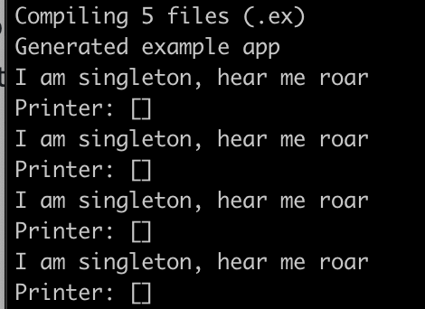

# Example of how to have only one worker in an Elixir Cluster

## Pre-requiste Knowledge
There are a few concepts that are integral to undestanding this document. They are listed below

*Cluster* - In Elixir/Erlang distribution is a first-class part of the language. Once started, an instance of an Elixir application can attempt to connect to other instances—on the same network. This grouping is called a cluster.

*Node* - Each Elixir application instance in a Cluster

*Process* - In Elixir all executable code is a process. Processes are like system processes but they are quicker to standup. Each process runs exactly one function.

*Message* - Processes can communicate via messages. Messages are sent and enqueued in a mailbox, this mailbox is not backed by the disk and is lost if a process crashes. A process has the ability to read messages off the mailbox in the order they were received.

*Supervisor* - In Elixir/Erlang fault tolerance is a first-class feature. Since `Process`es can crash, supervisors exist to restart them. Supervisors take a list of child processes, and have a strategies which they use to determine,how often to restart children.

*Supervision Tree* - Since `Supervisor`s manage the Processes under them, it is possible to create wide, or deep trees of `Supervisor`s in Elixir, referred to as a Supervision Tree.

*GenServer* - the Elixir core-library feature that extracts the boilerplate code around `Message`s and state management.

*Application* - is a runnable set of code, that has a predefined directory structure. 

## Motivation 
Since an application instance is part of a `Cluster`, we want to be able to have `Node`s automatically join and leave a `Cluster` upon starting, this is achieved using a library called `libcluster`. 

We have a use-case where we want to ensure that there is only one instance of the Singleton module for all `Node`s. Singleton is a `GenServer` that just loops, and prints out the text "I am singleton, hear me roar" to standard out.

When the Singleton starts, it registers its name as globally unique for the Cluster.

```elixir
# lib/example/singleton.ex
defmodule Singleton do
  use GenServer

  def start_link(_) do
    # __MODULE__ is a way to reference the name of this module. The `:global` atom provides global uniqueness. 
    GenServer.start_link(__MODULE__, :ok, name: {:global, __MODULE__}) 
  end

  # ...
end
```

This seems like a great sentence to read, but it like all things, has trade-offs.

# What does this code do?

When this application starts it attempts to join a local `Cluster`. If a `Cluster` is not found, it creates one.
Each application instance attempts to create an instance of the Singleton. However, the Singleton uses an Elixir feature that marks itself as global for the cluster it is part of. If another `Application` instance attempts to start another Singleton the Singleton crashes.

In Elixir if a child `Process` crashes frequently enough, the Supervisor will crash. Since the Singleton is a child of the Application, that means that the whole application instance would crash—no bueno. So what we have to do is create an intermediary that can deal with this crashing, named SingletonSupervisor. 

SingletonSupervisor uses a restart strategy of `:temporary` which means, if the process crashes then don't restart it. 
The resulting application Supervisor Tree is as follows:

```
             ---------------[App]--------------
             |                |               |
             V                V               V
[Cluster.Supervisor] [SingletonSupervisor] [Printer]
                              |
                              V
                         [Singleton]
```                     

The application has three children: Cluster.Supervisor, SingletonSupervisor, and Printer.

- SingletonSupervisor, manages our Singleton module.
- Cluster.Supervisor is part of the `libcluster` library, and manages the connection to the `Cluster`. 
- Printer, exists only to show that our application is up and running. It just prints out the Nodes in the `Cluster` every second. Think of this as our healthcheck.

## How do I run this?

1) Navigate to the directory where you cloned this codebase
2) Execute `mix deps.get`
3) Start up as many instances you would like by running: 
`elixir --sname <instance_name> --cookie foo -S mix run --no-halt`

### What do these arguments mean?

- elixir - run the elixir application
- --sname <instance_name> - name of the Elixir Node on your local network
- --cookie - secret token Elixir Nodes use to verify that they should connect.
- foo - the secret token on your local machine. This has to be the same as your `secret` in config/config.exs
- -S mix - loads your local project
- run --no-halt - runs your project

### Example 

Once you are in the directory, start up an instance of the application, let's name it "bob".

`elixir --sname bob --cookie foo -S mix run --no-halt` 

Bob starts printing out the Nodes in the cluster, currently an empty list. This is represented by `[]`.



Now let's start a second Node. Let's call this one, "alice".

In a new terminal window run: `elixir --sname alice --cookie foo -S mix run --no-halt`

You should notice two things occur:
1) The bob node no longer prints "I am singleton, hear me roar"
2) Both bob and alice, print the other's name in an array. Example: "[alice@yourmachine]"

# Trade-offs
## What did we gain?
We have now seen that there is only one Singleton running in the entire `Cluster`. We observe this by "I am singleton, hear me roar" only being printed to one terminal. 

## What did we lose?
This might seem like a good solution, however let's try closing the window that is currently printing out "I am singleton, hear me roar". You will notice that no other Node begins printing "I am singleton, hear me roar". 

We have only guarenteed that Singleton is unique, not that it is fault tolerant. As a result, this is not a good solution to use in production code.

# Conclusion

This document goes over some of the key concepts to understanding how to Cluster Elixir Nodes together. We then discussed some the usage of the `:global` flag, and the uniqueness it gives us for a Process in a Cluster. Lastly, we saw the shortcomings of this approach, namely that this is a **NOT** a fault tolerant solution. More research has to be done in order to give that guarentee.


